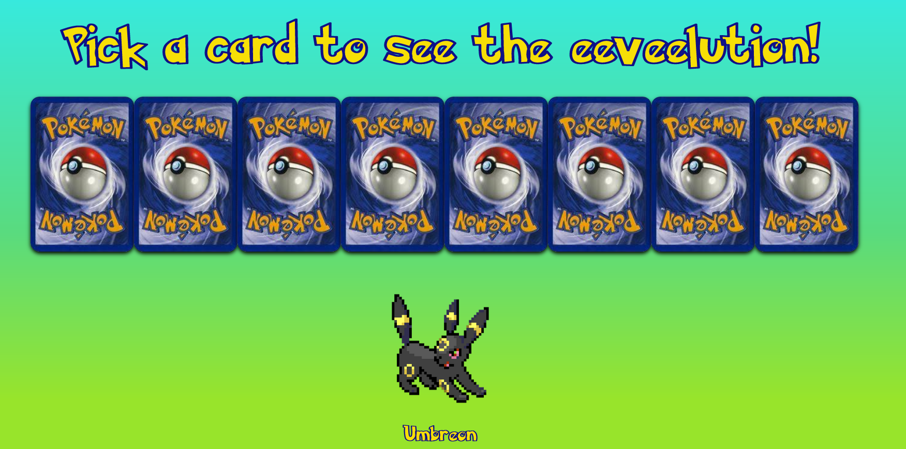

# VIDii
Project interface &amp; interactie

# Procesverslag
Markdown is een simpele manier om HTML te schrijven.  
Markdown cheat cheet: [Hulp bij het schrijven van Markdown](https://github.com/adam-p/markdown-here/wiki/Markdown-Cheatsheet).

Nb. De standaardstructuur en de spartaanse opmaak van de README.md zijn helemaal prima. Het gaat om de inhoud van je procesverslag. Besteedt de tijd voor pracht en praal aan je website.

Nb. Door *open* toe te voegen aan een *details* element kun je deze standaard open zetten. Fijn om dat steeds voor de relevante stuk(ken) te doen.

## Jij

### Ontwerper:
Bryan van de Pol 
500786426

#### Je startniveau:
Mijn startniveau is blauw. Door de jaren heb ik wel coderen gehad, maar was ik er eerlijk gezegd nooit echt een topper in. 

# Je plan

  
 Me plan is om in de lessen problemen aan te pakken die ik thuis niet kan oplossen door hulp te vragen 

  ### De eerste versie/schets:
  

  ### De tweede versie/schets:
  
    
    
  ### Je ambitie: 
  Aan deze technieken/punten wil ik werken:
  - ik wil leren hoe ik iets stijl
  - Leren kleine interacties toe te voegen
  - Nette code leren typen zonder beautify
 

## Voortgang/Feedback 1

  
Mijn bevindingen + wijzigingen (minimaal 5)

  ### Bevinding 1:
  Idee 1 (pacman tijdlijn) is niet divers genoeg

  #### oplossing:
  Nieuw idee bedacht waarbij ik heb gekozen om ipv het tijdlijn idee met pacman te kiezen voor de eeveelutions met pokemonkaarten

  ### Bevinding 2:
  Te veel gebruik van classes ik heb ondervonden dat het gebruik van selectoren (elementen) gewenst is 

  #### oplossing:
  Opgezocht op w3 school hoe dit ongeveer werkte om mijn geheugen op te frissen
    
  ### Bevinding 3:
  Card flip werkt niet + shadows staan niet in positie

  #### oplossing:
  Gekeken naar de selectoren én de grootte van de boxshadows + kaart en dit aangepast naar de gewenste grootte
  
  ### Bevinding 4:
  Ik kan maar 1 kaart laten zien op 1 rij als ik er meer toevoeg staan deze onder elkaar en niet naast elkaar

  #### oplossing:
  Gevraagd aan rowin hoe ik er voor zorg dat ik just article ul li ul li toon met daarbij een kaart, zodat ze ook apart aan te passen zijn in css 
    
  ### Bevinding 5:
  Kaarten staan niet goed gepositioneerd (wel naast elkaar maar half in elkaar en de flip animatie is veel breder dan de kaart zelf)

  #### oplossing:
  Gekeken in chrome onder padding en deze in css weggehaald indien het niet nodig was (ook een flex container gemaakt met justify content) Dit zorgde ervoor dat de card flip van juist breedde was.
      

      

## Voortgang/Feedback 2

  
Mijn bevindingen + wijzigingen (minimaal 5)

  
  ### Bevinding 1:
  Commentaar is niet duidelijk of in het engels

  #### oplossing:
  Door mijn commentaar gegaan en deze duidelijker gemaakt voor anderen

  ### Bevinding 2:
  Javascript veranderd de image niet als bij een kaart click

  #### oplossing:
  Getest of dit met een button werkt (dit werkt) uiteindelijk bleek ik de selector niet goed te hebben getypt waardoor ik het element van de kaart niet        selecteerde

  ### Bevinding 3:
  Ik wil de lettertype van pokemon gebruiken, zodat het meer bij pokemon past. Alleen bij het inladen werkt deze niet op andere devices
  
  #### oplossing:
  Fontface toegevoegd met een url, zodat deze word overgenomen op andere devices
  
  ### Bevinding 4:
  Gradient wordt bij elke kaart hetzelfde toegepast en niet uniek per kaart
  
  ### oplossing:
  nieuwe selectoren gemaakt specifiek voor elke unieke kaart, zodat ik deze in css kan aanpassen
    
  ### Bevinding 5:
  Het is nog niet mogelijk om doormiddel van tab door de elementen van mijn pagina te gaan
  
  ### oplossing:
  Online gekeken en ik kwam erachter dat een image niet selecteerbaar is. De oplossing hiervoor is het een button te maken.

## Voortgang/Feedback 3

  
Mijn bevindingen + wijzigingen (minimaal 5)

  
  ### Bevinding 1:
  De pokemon kaart was niet mooi afgerond, waardoor er witruimte was

  #### oplossing:
  Border radius toegepast aan de voorkant, zodat het gelijk is (ook aan de boxshadow, zodat het de vorm volgt)

  ### Bevinding 2:
  Volgorde code klopte niet, elementen die voor de hele pagina waren stonden onderaan (zoals cursor of font)
 
  #### oplossing:
  Nogmaals door de code gegaan, zodat zulke elementen netjes bovenaan staan

  ### Bevinding 3:
  Toevoegen button om het selecteerbaar te maken werkt niet, omdat dan de css stijl van de kaart er niet meer is

  #### oplossing:
  Button onder de kaart doen, maar positioneren en stijlen. Dit zorgde ervoor dat de pokemon kaart te stijlen is met een leuke effect indien deze of :hover wordt of getabbed wordt. 
    
  ### Bevinding 4:
  Ik heb hier en daar code staan die niet van toepassing was, maar als test werd gebruikt

  #### oplossing:
  Door me code heen gegaan en verwijderd wat niet nodig was
    
  ### Bevinding 5:
  Bij het uploaden naar github kwamen de images niet goed over of werden niet goed getoond

  #### oplossing:
  ./images ipv ../images en opgelet onder eigenschappen of er niet PNG of png stond (github is case sensitive)
  
  ### Bevinding 6:
  De informatie onder de stenen, is niet erg informatief

  #### oplossing:
  Informatie opgezocht over het gebruik van de stenen en in welke toepassing, zodat de lezer meer heeft aan de informatie
    
    

## Reflectie

  
Mijn eindresultaat & persoonlijke ontwikkeling

  ### Je uitkomst - karakteristiek screenshot(s):
  
  Dit is het uiteindelijke resultaat 8 pokemonkaarten die klikbaar, hoverbaar en tabbaar zijn waarbij als je erop klikt eevee veranderd naar een andere evolutie
  

  ### Dit ging goed/Heb ik geleerd: 
  Korte omschrijving met plaatje(s)
  Ik heb geleerd beter met css te stijlen op basis van een plaatje. Ik had een pokemon kaart tijdens het cssen er naast gezet en ben zo langzamerhand deze gaan na maken.
  

  ### Dit was lastig/Is niet gelukt:
  Korte omschrijving met plaatje(s)
   Het is me jammer genoeg niet gelukt een keyframe animatie te maken van de transitie tussen pokemons. Ik had gelezen dat het te maken had met het feit dat ik de image inlaad via javascript en heb geprobeerd dit in css nog aan te passen maar dit lukte jammer genoeg niet. 
  

## Bronnenlijst

continu bijhouden terwijl je werkt

Nb. Wees specifiek ('css-tricks' als bron is bijv. niet specifiek genoeg).

Selectoren
https://www.w3schools.com/cssref/css_selectors.asp

Css card flip    
https://www.w3schools.com/howto/howto_css_flip_card.asp
    
Font
https://fonts.cdnfonts.com/s/17890/Pokemon Solid.woff
https://css-tricks.com/almanac/properties/f/font-display/
    
Cursor
https://cur.cursors-4u.net/games/gam-13/gam1282.cur
    
Pokemon informatie + plaatjes van de stenen
https://bulbapedia.bulbagarden.net
    
Javascript (image change + html change)
Gevraagd aan Yunus en Rowin
https://wlearnsmart.com/javascript-change-image-onclick-event/
    
Glow animatie
https://stackoverflow.com/questions/34821217/easily-create-an-animated-glow

