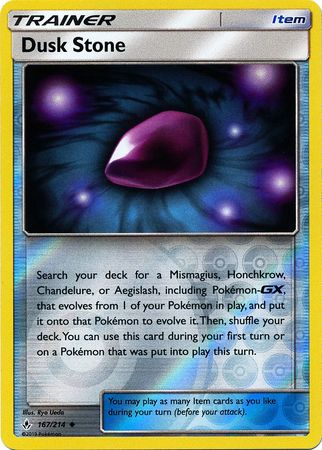

# VIDii
Project interface &amp; interactie

# Procesverslag
Markdown is een simpele manier om HTML te schrijven.  
Markdown cheat cheet: [Hulp bij het schrijven van Markdown](https://github.com/adam-p/markdown-here/wiki/Markdown-Cheatsheet).

Nb. De standaardstructuur en de spartaanse opmaak van de README.md zijn helemaal prima. Het gaat om de inhoud van je procesverslag. Besteedt de tijd voor pracht en praal aan je website.

Nb. Door *open* toe te voegen aan een *details* element kun je deze standaard open zetten. Fijn om dat steeds voor de relevante stuk(ken) te doen.

## Jij

### Ontwerper:
Bryan van de Pol 
500786426

#### Je startniveau:
Mijn startniveau is blauw. Door de jaren heb ik wel coderen gehad, maar was ik er eerlijk gezegd nooit echt een topper in. 

# Je plan

  
 Aan het begin had ik gekozen om een tijdlijn te maken met pacman. Echter kwam ik na feedback erachter dat er onvoldoende verschil is tussen de pacman versie's door de jaren heen. Bij de eerste versie kan je mijn oude idee zien. Door brain te stormen in de les heb ik besloten om de eeveelutions uit te werken in een website. Hierbij wil ik doormiddel van pokemon kaarten de eevee veranderen met behulp van HTML, CSS en Javascript. 

  ### De eerste versie/schets:
  

  ### De tweede versie/schets:
  
    
    
  ### Je ambitie: 
  Aan deze technieken/punten wil ik werken:
  - Ik mijn CSS styling verbeteren om nauwkeurig dingen te kunnen namaken (plaatsing van objecten, tekst en kleur in 1 object)
  - Ik wil beter worden in het toepassen van keyframe animaties in mijn code om zo een betere interactie te creeeren tussen gebruiker en website. 
  - Ik heb bijna nooit javascript gebruikt en zal graag willen leren hoe ik dit kan gebruiken, om zo elementen te kunnen veranderen doormiddel van queryselectors.
 

## Voortgang/Feedback 1 (feedback Rowin + Sanne)

  
Mijn bevindingen + wijzigingen (minimaal 5)

  ### Bevinding 1:
  Sanne en Rowin zeiden beiden als feedback dat de pacman niet divers genoeg was door de jaren heen, waardoor mijn idee niet uitgebreid genoeg gemaakt kon worden.

  #### oplossing:
  Ik heb gebrainstormt in de les en gekozen om in plaats van een tijdlijn door de jaren heen de eeveelutions te doen. Waarbij je doormiddel van       pokemonkaarten informatie krijgt over de eevee en ze doormiddel van een klik ook kan laten evolueren. 

  ### Bevinding 2:
  Aan het begin was ik volop bezig met het gebruik van classes. Echter kwam ik erachter dat het gebruik van selectoren gewenst is. 

  #### oplossing:
  Meteen classes aangepast, zodat ik niet teveel code type waarbij ik classes gebruik. Door op w3school te kijken heb ik mijn geheugen opgefrist en heb ik meteen de selectoren toegepast. 
    
  ### Bevinding 3:
  Door het aanpassen van de classes naar selectors werkte mijn cardflip animatie op :hover niet meer

  #### oplossing:
  Ik ben door de code heen gegaan en heb de HTML en CSS naast elkaar gehouden, zodat ik de correcte selector opschreef om de animatie weer te laten werken. Vervolgens werkte de animatie ook weer. 
  
      
  ### Bevinding 4:
  Bij de cardflip animatie verschuiven de elementen van de pokemonkaart te veel, waardoor je de helft ervan niet ziet. 
   

  #### oplossing:
  Ik heb samen met Sanne gekeken in chrome en het element geinspecteerd om te kijken of er ergens padding werd toegevoegd wat niet nodig was. Dit bleek ook te kloppen. Vervolgens heb ik een flex container gemaakt en justify content toegepast om de pokemonkaarten mooier te centreren.
      
  
  ### Bevinding 5:
  Hoe wil ik de pokemon kaarten plaatsen en hoe pas ik progressive disclosure toe?

  #### oplossing:
  Ik heb gekozen ervoor om de achterkant van de pokemonkaart te laten zien en deze doormiddel van een :hover of :focus-within informatie te laten tonen. Zo pas ik progressive disclosure toe waarbij de informatie over de pokemon kaart niet meteen te zien is. Verder heb laat ik de pokemonkaarten op horizontaal zien, zodat alle kaarten te zien zijn op het scherm.
  
  
  
  
 
      

      

## Voortgang/Feedback 2 Feedback Aaron

  
Mijn bevindingen + wijzigingen (minimaal 5)

  
  ### Bevinding 1:
  Toen aaron door mijn code ging had hij moeite met het begrijpen waarvoor welke code was. Dit kwam doordat ik onvoldoende of onduidelijke commentaar had geschreven

  #### oplossing:
  Ik ben langs al mijn commentaar gegaan en heb besloten hoe ik dit wil schrijven en wat voor beschrijving het moet geven. Zo heb ik ook commentaar in caps lock getypt om zo duidelijk te maken dat tussen deze regels alleen maar code staat die hiervoor gaat (als een soort hoofdstuk/onderwerp)

  ### Bevinding 2:
  Ik wilde doormiddel van javascript de eevee onder aan de pagina veranderen naar een andere evolutie. Echter werkte dit niet als ik op de pokemonkaart drukte. Terwijl ik wel de juiste selector had gebruikt.

  #### oplossing:
  Ik heb getest of dit werkte met een normale button. En dit bleek uiteindelijk wel te werken. Sanne kwam met het idee om de button te plaatsen op de pokemonkaart en deze te stylen, zodat deze wegvalt, maar wel de hele kaart bedekt. Door dit toe te passen werd de pokemon kaart klikbaar doormiddel van een button.

  ### Bevinding 3:
  Hoe kan ik ervoor zorgen dat de vormgeving meer past bij pokemon?
  
  #### oplossing:
  Ik heb de font van pokemon toegevoegd doormiddel van een fontface+url, zodat deze ook overgenomen wordt op andere devices en niet alleen op mijn pc. Hierdoor passen de kopteksten van de interface meer bij pokemon, waardoor het meer een geheel wordt.
  
  
  
  ### Bevinding 4:
  Hoe kan ik ervoor zorgen dat de pokemonkaarten meer een eigen karakter hebben? En op een pokemonkaart lijken?
  
  ### oplossing:
  Ik heb een container gemaakt en een foto erbij gehouden van de pokemonkaart en ben deze doormiddel van CSS gaan namaken. Vervolgens heb ik voor elke pokemon kaart nieuwe selectoren gemaakt specifiek voor elke unieke kaart. En heb ik hierbij toepasselijke gradients gezocht om zo elke kaart een uniekere look te geven die hoort bij de evolutiesteen.
  
  
    
  ### Bevinding 5:
 De pokemonkaarten zijn niet tabbaar, waardoor de website alleen te gebruiken is met een muis.
  
  ### oplossing:
  Uit onderzoek op het internet bleek dat images niet selecteerbaar zijn doormiddel van Tab. Sanne kwam met de oplossing om onder de pokemonkaart een button te plaatsen en deze te selecteren met een selector in CSS, zodat deze tabbaar is. Dit werkte en hangt ook samen met de klikbaarheid van de pokemonkaart als deze omdraait.

## Voortgang/Feedback 3 (feedback beoordeling sanne)

  
Mijn bevindingen + wijzigingen (minimaal 5)

  
  ### Bevinding 1:
  "De pokemonkaarten lijken niet klikbaar/interactief"

  #### oplossing:
  De oplossing hiervoor was erg simpel. Ik heb voor voor en achterkant cursor:pointer in css geschreven, zodat de pokemon kaart klikbaar lijkt en zo interactie vraagt van de gebruiker. Ook heb ik een kleine animatie toegevoegd die 1x afspeelt na 5 seconden om zo nieuwsgierigheid te wekken bij de gebruiker. 
  
  

  ### Bevinding 2:
  Hoe kan ik ervoor zorgen dat je ziet dat je de kaart geselecteerd hebt?
 
  #### oplossing:
  Ik heb een glow animatie toegevoegd als je over de kaart gaat toont het een semi-actieve staat. Vervolgens als je op de kaart drukt en de eevee veranderd dan zal de kaart een stukje omhoog gaan, om ze te tonen dat deze evolutie actief is. Doormiddel van dit wil ik de interactie tussen de pokemonkaart en gebruiker verbeteren en duidelijker maken.
  
  

  ### Bevinding 3:
  "Je hebt overal in je code geen CSS Custom properties gebruikt"

  #### oplossing:
  Door al me code gegaan en CSS custom properties netjes in de :root geschreven en vervolgens met --var toegepast bij elke kleur. Nu kan ik ook gemakkelijk kleuren aan passen indien gewenst, zondat dat ik helemaal naar beneden hoef te scrollen in mijn css. 
  
  
  ### Bevinding 4:
  Hoe verander ik de naam van de Eevee onder aan de pagina, zodat deze past bij de evolutie?

  #### oplossing:
  Ik heb gevraagd aan Yunus hoe dit werkte en heb vervolgens op internet de javascript hiervoor opgezocht. Ik moest hier voor de in dezelfde function zoals ik de image verander de innerhtml veranderen door een variable aan te maken van de eevee naam en deze dan te vervangen met een nieuwe naam. 
  
  
  
  ### Bevinding 5:
  Als ik mijn website open op een andere pc via github misde er een aantal afbeeldingen

  #### oplossing:
  Aaron had het in de les erover dat je moest opletten op hoofdletters onder eigenschappen van de foto's. Zo bleek dat github case sensitive is. Ik heb dit opgelost door ook ../images te schrijven ipv ./images en PNG of png. Uiteindelijk werken nu ook alle images op elke pc door dit aan te hebben gepast.  
 
  
  
  
   

## Reflectie

  
Mijn eindresultaat & persoonlijke ontwikkeling

  ### Je uitkomst - karakteristiek screenshot(s):
  Het uiteindelijke resultaat zijn 8 pokemonkaarten die interactie opwekken bij de gebruiker om zo door de evolutie te gaan van de eevee's. Je kan ze doormiddel van TAB of click gebruiken.
  
  
  
  
  
  

  ### Dit ging goed/Heb ik geleerd: 
  Ik heb geleerd aan de hand van een afbeelding een pokemonkaart na te maken doormiddel van een live server open te houden en zo stapsgewijs de CSS te schrijven. Ook heb ik geleerd hoe ik keyframes toepas om zo kleine animaties toe te voegen om de interactie tussen de gebruiker en product te verbeteren (iets dat heel belangrijk is) Ookal lag de focus meer op HTML en CSS heb ik ook veel geleerd over Javascript tijdens interface en interactie en hoe ik gebruik kan maken van queryselectors om zo afbeeldingen en namen te vervangen als er een bepaalde handeling uit wordt gevoerd (in dit geval een click of tab enter). Ik kan nu als ontwerper ook beter begrijpen en overleggen met developers wat wel of niet mogelijk zal gaan zijn in code als ik een ontwerp maak voor hen. Een skill die zeker van pas gaat komen later.
  

  ### Dit was lastig/Is niet gelukt:

  Ik vond het erg lastig om javascript te gebruiken. Doormiddel van hulp van Yunus heb ik gelukkig de queryselectors werkend gekregen om zo de eevee en naam te vervangen doormiddel van een click. 
  Wat me jammer genoeg niet gelukt is ios om een keyframe animatie te maken van de transitie tussen de pokemons. Uit onderzoek op het internet bleek dat dit kwam, omdat ik de image inlaad via javascript en dat de image niet al op de pagina staat met 0 opacity. En dat deze dan tijdens het evolueren omwisselt met de evolutie frame en de pokemon. 
  Verder had ik feedback gekregen van Sanne dat het niet duidelijk was welke pokemon kaart geselecteerd was als ik op een evolutie clickte. Ik heb geprobeerd dit met javascript op te lossen door een class toe te voegen als de click event gebeurd maar dit lukte niet. Vervolgens heb ik in plaats van dat in css een :active en :hover-within toegepast op de pokemon kaart en daarbij een negative -1em toegepast op de margin-top, zodat de pokemonkaart omhooggaat als die actief is. Alleen werkt deze oplossing niet 100%. Het werkt namelijk wel bij een click, maar bij een tab werkt dit niet, omdat de pokemonkaart dan wel gesloten wordt als je verder tabt. Dit sluit ook aan bij mijn volgende probleem, omdat het mij niet lukte om een class toe te voegen op een element lukte het mij ook niet om de glow effect te veranderen (dit leek mij een leuke extra om de interactie te verbeteren, zodat de gebruiker weet op welke kaarten die al heeft gedrukt. Hieronder de code die ik heb geprobeerd in beide gevallen. Ik heb vervolgens geprobeerd in CSS de kleuren te veranderen, maar dit werkte niet en is mij jammer genoeg ook uiteindelijk niet gelukt. 
  
  
  
  
  
 

  

## Bronnenlijst

continu bijhouden terwijl je werkt

Nb. Wees specifiek ('css-tricks' als bron is bijv. niet specifiek genoeg).

Selectoren
https://www.w3schools.com/cssref/css_selectors.asp

Css card flip    
https://www.w3schools.com/howto/howto_css_flip_card.asp
    
Font
https://fonts.cdnfonts.com/s/17890/Pokemon Solid.woff
https://css-tricks.com/almanac/properties/f/font-display/
    
Cursor
https://cur.cursors-4u.net/games/gam-13/gam1282.cur
    
Pokemon informatie + plaatjes van de stenen
https://bulbapedia.bulbagarden.net
    
Javascript (image change + html change)
Gevraagd aan Yunus en Rowin
https://wlearnsmart.com/javascript-change-image-onclick-event/
    
Glow animatie
https://stackoverflow.com/questions/34821217/easily-create-an-animated-glow

Shake animatie
https://unused-css.com/blog/css-shake-animation/

